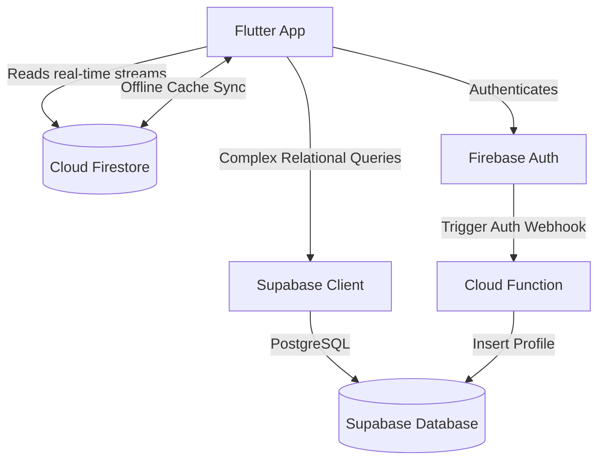

# Implementation Plan: Trip Buddy Foundational Architecture

This document provides a highly scalable, production-level, clean architecture foundation for **Trip Buddy**, integrating **Flutter, Firebase (Auth + Firestore + Cloud Functions)**, and **Supabase (PostgreSQL)**.

---

## User Review Required

> [!IMPORTANT]
> **State Management Choice**: We propose **Riverpod** over BLoC. While BLoC is excellent, Riverpod's reactive design, compile-time safety, lack of BuildContext dependency, and first-class support for `StreamProvider` and `FutureProvider` make it exceptionally suited for real-time Firebase syncing, Supabase connections, and caching strategies. Let us know if you have a hard requirement for BLoC.
> 
> **Dual DB Sync Strategy**: Firebase Auth is used for user registration. A Cloud Function / database trigger will automatically mirror the user record into Supabase PostgreSQL's `users` table. This keeps Auth speed and caching performance on Firebase, and relational capabilities on Supabase.

---

## Architectural Principles & Sync Flow

### Clean Architecture with Feature-First and Core Abstraction

To ensure modularity and scalability, we implement a hybrid Clean Architecture:
1. **Core Layer (`core/`)**: Cross-cutting utilities, error definitions, low-level HTTP/Dio clients, constants, themes, and global components.
2. **Configuration Layer (`config/`)**: Environment systems, routing definitions (`go_router`), and API service clients.
3. **Features Layer (`features/`)**: Organized by business domain (e.g., `auth`, `maps`, `railway`). Each feature maintains clear separation:
   - **Presentation**: UI widgets and Riverpod state managers (Notifiers/StateProviders).
   - **Domain/Data**: Local data models and direct feature operations (mapping to global repositories).
4. **Data Repositories (`repositories/`) & Models (`models/`)**: Shared access layers mapping raw API, Firestore, or Supabase endpoints into strongly-typed Dart objects.

### Sync & Real-Time Caching Flow



---

## Proposed Folder Structure

We will populate the project with the exact structure requested:

```
lib/
├── core/
│    ├── constants/
│    │    ├── app_colors.dart
│    │    ├── app_strings.dart
│    │    └── app_assets.dart
│    ├── theme/
│    │    └── app_theme.dart
│    ├── utils/
│    │    ├── logger.dart
│    │    └── validators.dart
│    ├── services/
│    │    ├── location_service.dart
│    │    └── maps_api_service.dart
│    ├── network/
│    │    ├── dio_client.dart
│    │    └── api_endpoints.dart
│    ├── errors/
│    │    ├── failure.dart
│    │    └── exceptions.dart
│    └── widgets/
│         ├── custom_button.dart
│         ├── custom_text_field.dart
│         └── loading_indicator.dart
│
├── config/
│    ├── routes/
│    │    ├── app_routes.dart
│    │    └── route_names.dart
│    ├── firebase/
│    │    └── firebase_options.dart  (placeholder or auto-generated)
│    ├── supabase/
│    │    └── supabase_config.dart
│    └── env/
│         └── env_config.dart
│
├── features/
│    ├── auth/
│    │    ├── presentation/
│    │    │    ├── login_screen.dart
│    │    │    └── signup_screen.dart
│    │    └── auth_provider.dart
│    ├── home/
│    ├── maps/
│    ├── railway/
│    ├── bus/
│    ├── worker/
│    ├── profile/
│    └── ai_assistant/
│
├── models/
│    ├── user_model.dart
│    ├── trip_model.dart
│    ├── train_route_model.dart
│    ├── bus_route_model.dart
│    ├── saved_place_model.dart
│    └── booking_model.dart
│
├── providers/
│    ├── global_providers.dart
│    └── state_providers.dart
│
├── repositories/
│    ├── auth_repository.dart
│    ├── database_repository.dart
│    └── maps_repository.dart
│
└── main.dart
```

---

## Database Planning (PostgreSQL Schema)

To design a scalable, highly optimized relational storage system, we define the following tables to be hosted in **Supabase**. We leverage proper constraints, indexes, and Foreign Keys.

### 1. `users` Table
Handles both general customers and workers, maintaining role integrity.
```sql
CREATE TYPE user_role AS ENUM ('user', 'worker');

CREATE TABLE users (
    id UUID PRIMARY KEY, -- Maps to Firebase Auth UID
    email VARCHAR(255) UNIQUE NOT NULL,
    full_name VARCHAR(100) NOT NULL,
    phone_number VARCHAR(20),
    role user_role NOT NULL DEFAULT 'user',
    avatar_url TEXT,
    created_at TIMESTAMP WITH TIME ZONE DEFAULT CURRENT_TIMESTAMP,
    updated_at TIMESTAMP WITH TIME ZONE DEFAULT CURRENT_TIMESTAMP
);

CREATE INDEX idx_users_role ON users(role);
```

### 2. `workers` Table
Maintains specialized profiles for workers with live location coordinates (PostGIS ready).
```sql
CREATE TABLE workers (
    id UUID PRIMARY KEY REFERENCES users(id) ON DELETE CASCADE,
    service_type VARCHAR(50) NOT NULL, -- e.g., 'driver', 'guide'
    vehicle_type VARCHAR(50),
    vehicle_number VARCHAR(30),
    rating NUMERIC(3, 2) DEFAULT 5.00 CHECK (rating BETWEEN 0 AND 5),
    is_active BOOLEAN DEFAULT false,
    last_known_lat DOUBLE PRECISION,
    last_known_lng DOUBLE PRECISION,
    updated_at TIMESTAMP WITH TIME ZONE DEFAULT CURRENT_TIMESTAMP
);

CREATE INDEX idx_workers_active_loc ON workers(is_active) WHERE is_active = true;
```

### 3. `trips` Table
For scalable multi-destinational and single-destinational planning.
```sql
CREATE TYPE trip_status AS ENUM ('planning', 'upcoming', 'ongoing', 'completed', 'cancelled');

CREATE TABLE trips (
    id UUID PRIMARY KEY DEFAULT gen_random_uuid(),
    user_id UUID NOT NULL REFERENCES users(id) ON DELETE CASCADE,
    title VARCHAR(150) NOT NULL,
    description TEXT,
    start_date DATE NOT NULL,
    end_date DATE NOT NULL,
    budget NUMERIC(12, 2) DEFAULT 0.00,
    status trip_status NOT NULL DEFAULT 'planning',
    created_at TIMESTAMP WITH TIME ZONE DEFAULT CURRENT_TIMESTAMP,
    updated_at TIMESTAMP WITH TIME ZONE DEFAULT CURRENT_TIMESTAMP
);

CREATE INDEX idx_trips_user ON trips(user_id);
```

### 4. `train_routes` Table
Stores schedules and static route profiles for search lookups.
```sql
CREATE TABLE train_routes (
    id UUID PRIMARY KEY DEFAULT gen_random_uuid(),
    train_number VARCHAR(20) UNIQUE NOT NULL,
    train_name VARCHAR(100) NOT NULL,
    source_station VARCHAR(100) NOT NULL,
    destination_station VARCHAR(100) NOT NULL,
    departure_time TIME NOT NULL,
    arrival_time TIME NOT NULL,
    stops JSONB NOT NULL, -- Detailed array of station profiles & timings
    runs_on VARCHAR(15) NOT NULL, -- e.g., '1,2,3,4,5,6,7' for daily
    classes TEXT[] NOT NULL, -- e.g., ['1A', '2A', '3A', 'SL']
    created_at TIMESTAMP WITH TIME ZONE DEFAULT CURRENT_TIMESTAMP
);

CREATE INDEX idx_train_search ON train_routes(source_station, destination_station);
```

### 5. `bus_routes` Table
Schedules for regional bus connections.
```sql
CREATE TABLE bus_routes (
    id UUID PRIMARY KEY DEFAULT gen_random_uuid(),
    bus_operator VARCHAR(100) NOT NULL,
    bus_type VARCHAR(50) NOT NULL, -- AC, Non-AC, Sleeper
    source VARCHAR(100) NOT NULL,
    destination VARCHAR(100) NOT NULL,
    departure_time TIME NOT NULL,
    arrival_time TIME NOT NULL,
    fare NUMERIC(10, 2) NOT NULL,
    seats_available INT DEFAULT 40,
    created_at TIMESTAMP WITH TIME ZONE DEFAULT CURRENT_TIMESTAMP
);

CREATE INDEX idx_bus_search ON bus_routes(source, destination);
```

### 6. `saved_places` Table
Personalized location bookmarking.
```sql
CREATE TABLE saved_places (
    id UUID PRIMARY KEY DEFAULT gen_random_uuid(),
    user_id UUID NOT NULL REFERENCES users(id) ON DELETE CASCADE,
    place_id VARCHAR(255) NOT NULL, -- Maps to Google Places ID
    place_name VARCHAR(150) NOT NULL,
    formatted_address TEXT,
    latitude DOUBLE PRECISION NOT NULL,
    longitude DOUBLE PRECISION NOT NULL,
    category VARCHAR(50), -- e.g., 'hotel', 'restaurant', 'attraction'
    created_at TIMESTAMP WITH TIME ZONE DEFAULT CURRENT_TIMESTAMP,
    UNIQUE(user_id, place_id)
);

CREATE INDEX idx_saved_places_user ON saved_places(user_id);
```

### 7. `bookings` Table
Centralized booking ledger for both modes of transportation.
```sql
CREATE TYPE booking_type AS ENUM ('train', 'bus');
CREATE TYPE booking_status AS ENUM ('pending', 'confirmed', 'cancelled');

CREATE TABLE bookings (
    id UUID PRIMARY KEY DEFAULT gen_random_uuid(),
    user_id UUID NOT NULL REFERENCES users(id) ON DELETE CASCADE,
    booking_type booking_type NOT NULL,
    route_id UUID NOT NULL, -- Refers to either train_routes(id) or bus_routes(id) dynamically
    booking_date TIMESTAMP WITH TIME ZONE DEFAULT CURRENT_TIMESTAMP,
    travel_date DATE NOT NULL,
    fare_paid NUMERIC(10, 2) NOT NULL,
    status booking_status NOT NULL DEFAULT 'pending',
    seat_details VARCHAR(50),
    payment_intent_id VARCHAR(255),
    metadata JSONB,
    created_at TIMESTAMP WITH TIME ZONE DEFAULT CURRENT_TIMESTAMP
);

CREATE INDEX idx_bookings_user ON bookings(user_id);
```

---

## Recommended Packages (`pubspec.yaml`)

We select premium, industry-standard packages to support scalable and clean operations:

```yaml
dependencies:
  flutter:
    sdk: flutter

  # State Management & DI
  flutter_riverpod: ^2.5.1
  riverpod_annotation: ^2.3.3

  # Routing
  go_router: ^14.2.1

  # Network
  dio: ^5.5.0
  retrofit: ^4.1.0

  # Firebase Core & Client SDKs
  firebase_core: ^2.32.0
  firebase_auth: ^4.19.7
  cloud_firestore: ^4.17.5

  # Supabase client SDK
  supabase_flutter: ^2.5.4

  # Google Maps & Geolocation
  google_maps_flutter: ^2.6.2
  geolocator: ^12.0.0
  geocoding: ^3.0.0

  # Configuration
  flutter_dotenv: ^5.1.0

  # UI & Design Utilities
  google_fonts: ^6.2.1
  flutter_spinkit: ^5.2.1
  logger: ^2.3.0
```

---

## Security Best Practices

1. **Supabase Row Level Security (RLS)**: Enable RLS on every PostgreSQL table. Create policies so users can only view and update their own trips, bookings, and profile records.
2. **Firestore Security Rules**: Strictly limit access based on authentication state:
   ```javascript
   service cloud.firestore {
     match /databases/{database}/documents {
       match /users/{userId} {
         allow read, write: if request.auth != null && request.auth.uid == userId;
       }
     }
   }
   ```
3. **Environment Isolation**: Prevent sensitive API keys (Google Maps, Firebase Server keys, Supabase Service keys) from leaking into Git. We maintain `.env.development` and `.env.production` files.
4. **JWT Verification**: Validate Firebase tokens when bridging backend functions to Supabase or custom endpoints.

---

## Proposed Verification Plan

### Automated Checks
- **Flutter Code Analysis**: Run `flutter analyze` to ensure structural alignment and syntax compliance.
- **Dependency Checks**: Run `flutter pub get` and ensure zero dependency conflicts.

### Manual Verification
- **Visual Structure Review**: Walk through the directory tree.
- **Provider Injection Verification**: Verify `ProviderContainer` initialization in `main.dart`.
